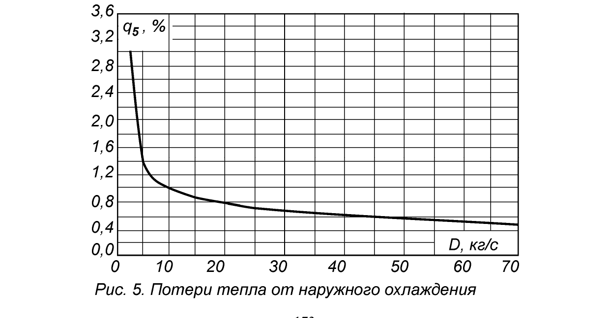

# Инструкция по использованию — Расчёт КПД парового котла

Программа считает КПД котла **обратным балансом** по данным одного опыта (испытания).
Все значения — это то, что вы измеряете на котле в момент опыта или берёте из
лабораторного анализа топлива. Программа сама ничего не измеряет — она только считает
по формулам нормативной методики (см. `README.md`).

## Общий порядок работы

1. Запустить `python3 kpd_gui.py` (или `KPD_Kotla.exe` на Windows).
2. В разделе **«Топливо»** выбрать вид топлива и марку (можно скорректировать состав
   под фактический анализ вашей пробы).
3. В разделе **«Режим котла»** вписать замеры, снятые во время опыта.
4. В разделе **«Потери»** вписать данные лабораторного анализа (для твёрдого топлива)
   и/или справочные значения (см. ниже, откуда их брать).
5. Нажать **«Рассчитать»**.
6. При необходимости — **«Сохранить отчёт...»** (текстовый файл с результатами).

---

## Раздел «Топливо»

### 1) Твёрдое топливо (уголь)

| Поле | Что вписывать | Откуда брать |
|---|---|---|
| Марка (справочная) | Ближайший по составу сорт угля из списка | Ориентировочно, если нет точного анализа |
| **Wr, влажность %** | Фактическая влажность рабочей массы | Лабораторный анализ угля (это поле **всегда стоит обновлять** по факту — влажность сильно колеблется от партии к партии) |
| **Ar, зольность %** | Фактическая зольность рабочей массы | Лабораторный анализ угля (тоже обновлять по факту) |
| Sr, Cr, Hr, Nr, Or | Элементный состав (сера/углерод/водород/азот/кислород) | Если нет полного анализа — можно оставить значения марки-пресета (это единственные поля, где типовое приближение обычно приемлемо, т.к. они меньше влияют на итог, чем Wr/Ar) |
| **Qir, теплота сгорания, МДж/кг** | Низшая теплота сгорания рабочей массы | Лучше всего — из калориметрической бомбы (измеренное значение). Если неизвестно — **поставьте 0**, тогда программа посчитает сама по формуле Менделеева из состава Cr/Hr/Or/Sr/Wr |
| t топлива, °C | Температура угля перед подачей | Обычно 20°C летом, 0°C зимой (можно не измерять) |

### 2) Жидкое топливо (мазут)

То же самое, но:
- марка — выбирается по содержанию серы (малосернистый/сернистый/высокосернистый)
- **t топлива** — здесь важно: мазут подогревается перед форсунками, реальная
  температура обычно **90–140°C** (не 20°C, как для угля)
- дополнительно в ядре расчёта учитывается пар на распыл мазута (форсунки), но эти
  поля в текущей версии GUI не выведены отдельно — при необходимости точного учёта
  паромеханических форсунок редактируйте `dф`/`iф` в `kpd_core.py` (`KpdInputs`)

### 3) Газообразное топливо

Вписываются **объёмные проценты компонентов сухого газа**: CH4, C2H6, C3H8, C4H10,
H2, H2S, CO, CO2, N2, O2 — их сумма должна быть примерно 100%.

| Поле | Откуда брать |
|---|---|
| Состав компонентов | Паспорт газа от поставщика (для природного газа) или анализ (для коксового/доменного) |
| **Qir, МДж/м³** | Из паспорта газа, либо справочное для выбранной марки-пресета |

Готовые пресеты в списке марок (природный газ, коксовый, доменный) — это **справочные
типовые составы**, не для конкретного месторождения. Для точного расчёта лучше
подставить состав из паспорта своего газа.

---

## Раздел «Режим котла» (замеры на опыте)

**Часть значений в этом разделе — не универсальные умолчания, а паспортные
характеристики конкретной модели котла.** Все примеры и умолчания в программе
(D=45-50 т/ч, Pпе=1.4 МПа, Tпе=250°C, t.пит.воды≈100°C) взяты из паспорта котла
**К-50-14** (вертикально-водотрубный барабанный, П-образная компоновка, естественная
циркуляция) — именно такие стоят в исторических данных этого проекта (котельная
УПК №1 Таштагол). **Если у вас другая модель котла — подставляйте паспортные значения
вашего котла**, а не эти цифры: они появились в программе только потому, что мы
проверяли расчёт на данных именно этой котельной.

| Поле | Что это | Откуда брать |
|---|---|---|
| **D номинальная, т/ч** | Паспортная (проектная) паропроизводительность **вашего** котла | Паспорт/шильдик котла (для К-50-14 — 50 т/ч; для другой модели — её собственный паспорт) |
| **D фактическая, т/ч** | Реальная паропроизводительность в момент опыта | Показания расходомера пара во время испытания (это всегда измерение, не из паспорта) |
| t холодного воздуха, °C | Температура воздуха на входе в дутьевой вентилятор | Термометр в машзале/на воздухозаборе (обычно 20-30°C) |
| t уходящих газов, °C | Температура газов на выходе из котла (перед дымососом) | Термометр/термопара в газоходе |
| **O2 в уход.газах, %** | Содержание кислорода в уходящих газах | Газоанализатор, **точка замера — перед дымососом** (ближе всего к фактическому выходу газов из котла; если мерили в другой точке тракта — например, «перед скруббером» или «за пароперегревателем» — результат q2 будет отличаться, см. `README.md`, раздел про точность) |
| CO в уход.газах, % | Содержание угарного газа в уходящих газах | Газоанализатор, та же точка, что и O2 |
| Tпе, °C | Температура перегретого пара (паспортная — для К-50-14 250°C; проверяйте по паспорту своего котла) | Термометр/датчик на выходе пароперегревателя |
| Pпе, МПа | Давление перегретого пара (паспортное — для К-50-14 14 кгс/см²≈1.4 МПа; проверяйте по паспорту своего котла) | Манометр (**внимание: если у вас манометр в кгс/см², переведите в МПа умножением на 0.0981**, например 14 кгс/см² → 1.37 МПа) |
| t питательной воды, °C | Температура питательной воды (паспортная — для К-50-14 ≈104°C) | Термометр на линии питательной воды |
| Продувка, % | Непрерывная продувка котла | Расход продувочной воды / расход пара × 100% (обычно 1-3%) |

---

## Раздел «Потери»

### Измеряется лабораторией (только для твёрдого топлива)

| Поле | Откуда брать |
|---|---|
| **Горючие в уносе, %** | Химический анализ золы уноса (пробы из золоуловителя) на содержание несгоревшего углерода |
| **Горючие в шлаке, %** | Химический анализ шлака (провала топки) на содержание несгоревшего углерода |
| Доля золы в уносе (аун) | Обычно **0.95** для камерных топок с твёрдым шлакоудалением при сжигании угля (см. табл.8 методики в [методичка Смородина С.Н. и др., СПбГТУРП](https://nizrp.narod.ru/metod/kpte/2019_01_19_01.pdf)); для мазута/газа эти три поля не используются |

Для мазута и газа механического недожога практически нет — оставьте горючие = 0.

### Справочные (программа их не вычисляет — берутся из таблиц методики)

**Важно: программа не привязана к конкретной модели котла в коде.** D_ном, q5 и т.д. —
обычные поля ввода, работающие для любого котла. Модель котла (например, паровой котёл
**К-50-14** — 50 т/ч, 14 кгс/см² ≈ 1.37 МПа, именно такие стоят на объектах в архиве
проекта) нужна вам только для того, чтобы найти *свои* справочные q3/q5 в методической
литературе или паспорте вашего конкретного котла — в этом репозитории такого документа
нет, ниже — общие ориентиры.

Табл.8 и рис.5 относятся к *проектному* расчёту (типовые значения для новых котлов).
Для уже работающего конкретного котла точнее — паспорт наладки/последние заводские
или пусконаладочные испытания именно этого котла (если такие документы у вас есть) —
там q3/q5 определены экспериментально для вашего оборудования, а не по общей таблице.
Если таких документов нет — можно взять готовое q3/q5 из старого протокола испытаний
этого же котла (они меняются редко, в отличие от Wr/Ar/O2, которые «плавают» от опыта
к опыту).

#### q3 — химический недожог (Табл.8 источника, стр.156)

Камерные топки, твёрдое шлакоудаление, D>21 кг/с (≈75 т/ч), **q3=0** для всех топлив
этой группы; ниже — потери q4 и доля уноса золы аун из той же таблицы (справочно,
для проектного расчёта нового котла таких же параметров):

| Топливо | αт на выходе из топки | q4, % | аун |
|---|---|---|---|
| Антрациты | 1.2–1.25 | 6 | 0.95 |
| Полуантрациты | 1.2–1.25 | 4 | 0.95 |
| Тощие угли | 1.2–1.25 | 2 | 0.95 |
| Каменные угли | 1.15–1.2 | 1–1.5 | 0.95 |
| Отходы углеобогащения | 1.15–1.2 | 2–3 | 0.95 |
| Бурые угли | 1.15–1.2 | 0.5–1 | 0.95 |

Мазут и газ (камерные топки, q3+q4 суммарно):

| Топливо | αт | q3+q4, % |
|---|---|---|
| Мазут | 1.02–1.05 | 0.1–0.5 |
| Природный/попутный/коксовый газ | 1.05–1.1 | 0.1–0.5 |

Котлы среднего класса (D=7–13 кг/с ≈ 25–47 т/ч, пылевидное сжигание, твёрдое
шлакоудаление) — потери выше, чем у крупных котлов, и заметно зависят от размера:

| Топливо | D=7 кг/с (25 т/ч) | D=10 кг/с (36 т/ч) | D=13 кг/с (47 т/ч) | аун |
|---|---|---|---|---|
| Каменные угли, q4 % | 5 | 3 | 2–3 | 0.95 |
| Бурые угли, q4 % | 3 | 1.5–2 | 1–2 | 0.95 |
| Фрезерный торф, q4 % | 3 | 1.5–2 | 1–2 | 0.95 |
| q3 (для всех трёх видов топлива) | 0.5 | 0.5 | 0.5 | — |

#### q5 — потери в окружающую среду (Рис.5 источника, стр.173)

В самой программе есть кнопка **«Подсказать по D ном. (рис.5)»** рядом с полем q5 —
она вычисляет значение по оцифрованной кривой автоматически, вручную искать по
графику не нужно. Сама кривая для справки:



*Рис.5 «Потери тепла от наружного охлаждения», источник: Смородин С.Н. и др.,
СПбГТУРП, [методичка](https://nizrp.narod.ru/metod/kpte/2019_01_19_01.pdf), стр.173.
Приведена в качестве иллюстрации/цитаты одного технического графика из открыто
доступного учебного пособия с указанием источника — сам PDF целиком в этот
репозиторий не копируется, см. `README.md`.*

Оцифрованные вручную по графику опорные точки (использует функция
`q5_reference_percent()` в `kpd_core.py`):

| D, т/ч | 7 | 18 | 36 | 72 | 108 | 144 | 180 | 216 | 252 |
|---|---|---|---|---|---|---|---|---|---|
| q5, % | 3.0 | 1.35 | 1.05 | 0.85 | 0.72 | 0.62 | 0.57 | 0.50 | 0.45 |

Для К-50-14 (D=50 т/ч) кнопка-подсказка даёт **q5≈0.97%** — заметно точнее, чем
диапазон «на глаз» 1.0–1.5%, которым мы пользовались до оцифровки графика.

---

## Как читать результат

```
q2 (с уходящими газами)   — потери от неполного использования тепла газов (зависит от t.ух и O2)
q3 (хим. недожог)         — см. выше, справочное
q4 (мех. недожог)         — считается из горючих в уносе/шлаке (только твёрдое топливо)
q5 (в окр. среду)         — справочное, пересчитанное на факт. нагрузку
q6 (с теплом шлака)       — считается из зольности и доли шлакоудаления
КПД котла (брутто)        — 100 - (q2+q3+q4+q5+q6)
B                         — расход топлива, кг/ч (м³/ч для газа)
```

Если КПД получился **вне диапазона 40-100%** — программа выдаст предупреждение:
скорее всего перепутаны местами поля (классическая ошибка — O2 и «горючие в уносе»
случайно поменяны местами, оба поля выглядят как «просто процент»). Проверьте ввод.

---

## Точность

См. таблицу нормативной допустимой погрешности и результаты сверки с оригинальной
программой в `README.md`, раздел «Точность и нормативы допустимой погрешности».
Коротко: чем точнее вы знаете состав топлива (полный анализ, а не только влажность/
зольность) и чем точнее выбрана точка замера O2, тем ближе результат к категории I/II
испытаний (±1%). При типовых/справочных данных ожидайте точность уровня
эксплуатационных испытаний (2-3.5%).
